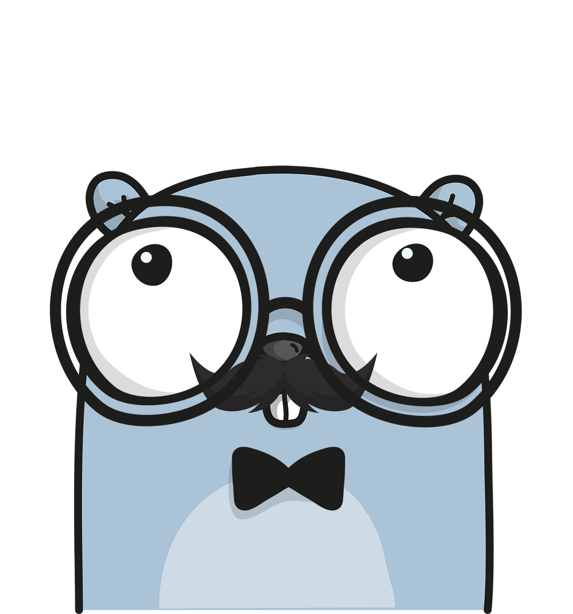

<pre>
██████╗  ██████╗     ████████╗███████╗███╗   ███╗██████╗ ██╗      █████╗ ████████╗███████╗
██╔════╝ ██╔═══██╗    ╚══██╔══╝██╔════╝████╗ ████║██╔══██╗██║     ██╔══██╗╚══██╔══╝██╔════╝
██║  ███╗██║   ██║       ██║   █████╗  ██╔████╔██║██████╔╝██║     ███████║   ██║   █████╗
██║   ██║██║   ██║       ██║   ██╔══╝  ██║╚██╔╝██║██╔═══╝ ██║     ██╔══██║   ██║   ██╔══╝
╚██████╔╝╚██████╔╝       ██║   ███████╗██║ ╚═╝ ██║██║     ███████╗██║  ██║   ██║   ███████╗
╚═════╝  ╚═════╝        ╚═╝   ╚══════╝╚═╝     ╚═╝╚═╝     ╚══════╝╚═╝  ╚═╝   ╚═╝   ╚══════╝
</pre>

<p align="center">
  
</p>

# Go Template - Hexa(go)nal architecture based on DDD

Go-template is an opinionated Hexagonal backend template written in GO.

## Architecture

The template is inspired by:
 - Hexagonal Architecture (also known as Port And Adapters)
 - Domain-Driven Design (DDD)
 - Clean Architecture
 - SOLID Principles
 - 12 Factor Methodology

## Features

- Provides database migration with [pressly/gooose](https://github.com/pressly/goose).
- Integrates [go-swagger](https://github.com/go-swagger/go-swagger) for compile-time generation of swagger.(yml|json).
- Integrates [SwaggerUI](https://github.com/swagger-api/swagger-ui) for live-previewing Swagger v2 schema.
- Comes with an initial MariaDB and Postgres database structure (
  see [migrations](https://github.com/NicklasWallgren/go-template/tree/main/resources/database/migrations))
- API endpoints for health and readiness probes.
- Easily testable. Integration tests with support for snapshots.
- Mocks via [mockery](https://github.com/vektra/mockery)
- K8s manifest files.
- Provides support for parallel database integration tests.
- Comes with support for AMQP publisher and consumer (via RabbitMQ).
- Various convenience scripts via `Makefile`.
- Multi-staged Dockerfile with support for BuildX for faster builds.
- CLI Layer which is easily extensible (and provided by spf13/cobra)
    - Command to handle migrations (migration).
    - Command to serve the http server.
    - Command to launch amqp consumer.
- Support for observability via [dd-trace-go](https://github.com/DataDog/dd-trace-go/)
- Dependency injection via [fx](https://github.com/uber-go/fx)

## Prerequisites

Requires the following prerequisites for development in a local environment

- Docker CE (v20.10+)
- Docker Compose (v1.27+)
- Go 1.19

## Quickstart
Initialize a new git repository through [GitHub Template feature](https://github.com/allaboutapps/go-starter/generate)

```bash 
# Clone the repository and then start the dev environment through the Makefile
make
```

## Merge with the repository to get future updates
```bash
git merge --no-commit --no-ff --allow-unrelated-histories NicklasWallgren/go-template
```

## Set the custom project name
```bash
find . -not -path '*/\.*' -type f -exec sed -i "" "s|github.com/NicklasWallgren/go-template|<REPLACE>|g" {} \;
```

## CLI
```bash
# Start the HTTP server
go-template start
# Start the AMQP consumers
go-template start-consumers
# Create a new migration file
go-template migrate --create <NAME>
# Rollup migrations
go-template migrate --up
```

## Re-generate mocks 
```bash
mockery --all --output ./tests/mocks --keeptree --case underscore --with-expecter
```

### Backlog
- Use https://github.com/RichardKnop/machinery for queue handling
- Implement gRPC api

### Code Guide

We use GitHub Actions to make sure the codebase is consistent (`golangci-lint run`) and continuously tested (`go test $(go list ./...) -p 1`). We try to keep comments at a maximum of 120 characters of length and code at 120.

## Contributing
If you find any problems or have suggestions about this template, please submit an issue. Moreover, any pull request, code review and feedback are welcome.

## License
[MIT](./LICENSE)